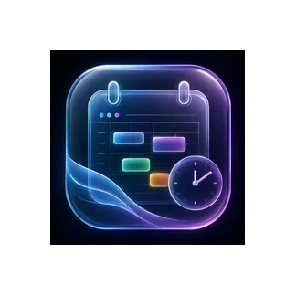

# ClassFlow 🔮✨

ClassFlow is a premium, high-fidelity academic companion application built natively for Android. It is designed to organize schedules, classes, tasks, and attendance under a unified **Liquid Glass design language** powered by custom GLSL shaders and real-time GPU refractions.



---

## 🚀 Key Features

* **Liquid Glass UI & Components**: Customized switch, icon button, slider, and frame layouts built using hardware-accelerated fragment shaders.
* **Unified Week Timetable**: Perfect Saturday column grids featuring horizontal scrolling and coordinate-aligned timeline trackers.
* **Adaptive Contrast Widgets**: Programmatic system wallpaper brightness detection that dynamically swaps widget text between deep charcoal black (on light wallpapers) and white/neon tints (on dark wallpapers).
* **Auto-Mute Study Mode**: Automated DND scheduler that syncs with class times, silencing disruptive notifications while showing real-time feedback toast notifications.
* **Real-time Glass Lab (Easter Egg)**: Tapping the ClassFlow logo 5 times in the About Screen opens a hidden customizer panel to adjust blur, displacement scales, and refractive thickness live.
* **Showcase Landing Page**: An interactive web showcase built with static glassmorphism, 3D card-tilt hover effects, and simulated wallpaper/DND toggles.

---

## 🛠️ Tech Stack & Architecture

* **Mobile Core**: Kotlin & Jetpack Compose (Declarative UI)
* **Graphics Pipeline**: Custom GLSL fragment shaders (AGSL / RenderEffect APIs)
* **Backdrop Blur**: Haze (modified coordinate-safe snapping layer)
* **State Management**: Hilt (Dependency Injection) & Compose ViewModel architectures
* **Widget Provider**: RemoteViews with dynamic WallpaperManager Color Contrast Hooks

---

## 📦 Building and Installing

To compile the release package and install the application directly onto your connected Android device, run the following Gradle command in the `android/` directory:

```bash
cd android
./gradlew installRelease
```

---

## 🌐 Showcase Website
The premium showcase landing page files are located at the root of this repository:
* `index.html`: Semantic layout with features showcase and interactive Glass Lab simulator.
* `style.css`: Ambient floating neon blobs, dark-theme styling, and glassmorphic variables.
* `script.js`: Interactive simulation code for schedule day-switching, DND notification blocker, and mouse card-tilt physics.

---

## 👨‍💻 Developer & Contact
Designed and engineered by **Anish Kumar**.
* **Instagram**: [@anish.___18__](https://www.instagram.com/anish.___18__?igsh=MXBmdGowbDFjdjV0cQ==)
* **LinkedIn**: [anish-kumar-94331a324](https://www.linkedin.com/in/anish-kumar-94331a324?utm_source=share_via&utm_content=profile&utm_medium=member_android)
* **Email**: [anish.kmr0509@gmail.com](mailto:anish.kmr0509@gmail.com)
* **GitHub**: [github.com/anish18](https://github.com/anish18)
